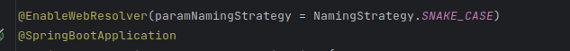

## Instruction

[简体中文](README.zh-CN.md)

This package can help you implement Spring parameter custom binding , such as automatic conversion of parameter names ,
currently provides RequestParam enhancements.

## Choose correct version

This project contains two versions, one for Spring5 and another for Spring6.  
For Spring5 you should use

```groovy kotlin
implementation("org.flmelody:spring-method-parameter-resolver:x.y.z-spring5")
```

For Spring6

```groovy kotlin
implementation("org.flmelody:spring-method-parameter-resolver:x.y.z-spring6")
```

## SpringBoot quick start

- enable resolver, add this `@EnableWebResolver(paramNamingStrategy = NamingStrategy.SNAKE_CASE) `in
  any `@Configuration` class, for example
  
- use `@WebParam` to replace Spring `@RequestParam`
  Now, your request parameter can accept snake-case parameter name

## Build your own namingStrategyHandler

- implement `NamingStrategyHandler`
- register your naming-strategy handler into bean factory

## Build your own methodArgumentResolver

- implement `WebMethodArgumentResolver`
- register your argument resolver into bean factory