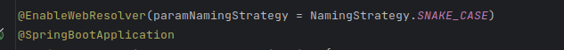

## 介绍

此包可帮助你实现 Spring 参数的自定义绑定，如参数名的自动转换，目前提供 RequestParam 增强功能。

## 选择合适的版本

该项目包含两个版本，一个适用于 Spring5，另一个适用于 Spring6。
对于 Spring5，应使用

```groovy kotlin
implementation("org.flmelody:spring-method-parameter-resolver:x.y.z-spring5")
```

对于 Spring6

```groovy kotlin
implementation("org.flmelody:spring-method-parameter-resolver:x.y.z-spring6")
```

## SpringBoot快速开始

- 启用解析器，请在任何`@Configuration`
  类中添加以下内容`@EnableWebResolver(paramNamingStrategy = NamingStrategy.SNAKE_CASE)`，例如
  
- 用 `@WebParam` 代替 Spring 的 `@RequestParam`
  现在，您的请求参数可以接受蛇形参数名

## 创建你自己的NamingStrategyHandler

- 实现 `NamingStrategyHandler`
- 在`BeanFactory`中注册你实现的处理器

## 创建你自己的MethodArgumentResolver

- 实现 `WebMethodArgumentResolver`
- 在`BeanFactory`中注册你实现的参数解析器